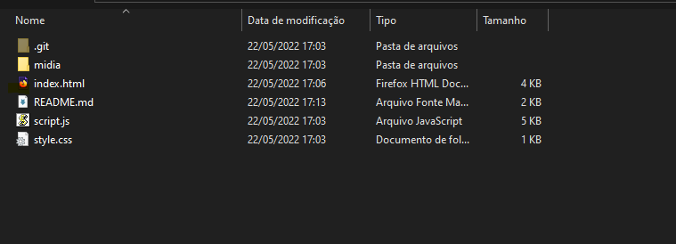
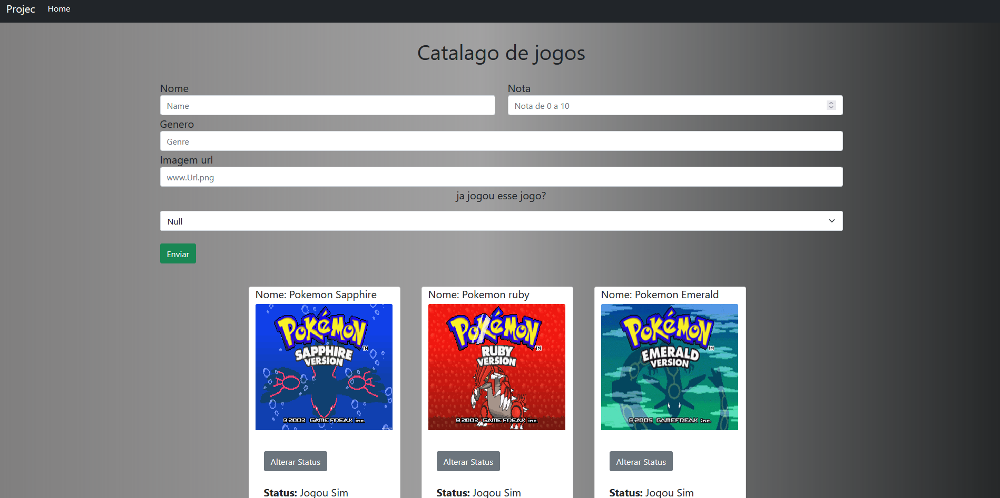

<h1 align="center"> ⚡ Projeto Games  ⚡</h1>

## Pre-requisitos 📝

### Para iniciar o projeto você ira precisa do <a href="https://nodejs.org/en/">Node js</a> e de uma ide recomendo o <a href="https://visualstudio.microsoft.com/pt-br/downloads/">Visual studio</a> e do <a href="https://git-scm.com/downloads">git</a> para clonar o projeto

```bash
# Clonado o projeto
$ git clone https://github.com/rafaelmasselli/CatálogoDeGames

```


## Iniciando o projeto na parte do Back-end 🎲

```bash
# Clonado o projeto
$ git clone https://github.com/rafaelmasselli/BackEnd-Games-NodeJs

# Instalando o projeto
$ npm install

# Iniciando o projeto como Usuário
$ npm start

# Iniciando o projeto como desenvolvedor
$ npm start dev

#O back-end ira iniciar na porta 3000
```

## Iniciando o projeto na parte do Front-end 🎲

> Com o Back-end rodando entre na pasta do Front-end



> Clique no index.html, ira abrir essa pagina web
> 

## Descrição

### Catálogo de jogos crud utilizando node js e html css

## Front-end

- [x] Consumo de todas as rest api

## Back-end

- [x] Visualizar. Get
- [x] Criar jogo. Post
- [x] Editar algum jogo. Patch

## Dependências usadas

### Front-end

- [x] Bootstrap
- [x] Html 5
- [x] CSS

### Back-end

- [x] Express
- [x] Nodemon
