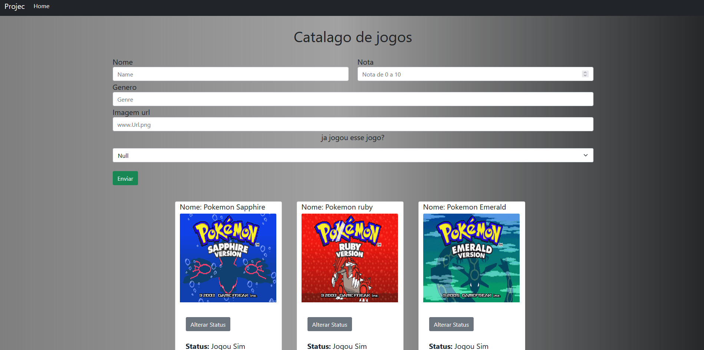

<h1 align="center"> ⚡ Front-end Games  ⚡</h1>

## Pre-requisitos 📝

### Para iniciar o projeto você ira precisa do <a href="https://nodejs.org/en/">Node js</a> e de uma ide recomendo o <a href="https://visualstudio.microsoft.com/pt-br/downloads/">Visual studio</a> e do <a href="https://git-scm.com/downloads">git</a> para clonar o projeto

## Iniciando o projeto na parte do Front-end 🎲

``` bash
# Clonado o projeto
$ git clone https://github.com/rafaelmasselli/FrontEnd-Game

```

> Com o Back-end rodando entre na pasta do Front-end


> Clique no index.html, ira abrir essa pagina web
> 

## Descrição

### Catalago de jogos

- [x] Consumo de Rest api

- [x] Visualizar. Get
- [x] Criar jogo. Post
- [x] Editar algum jogo. Patch

## Depedencias usadas

> Boostrap, html, css
